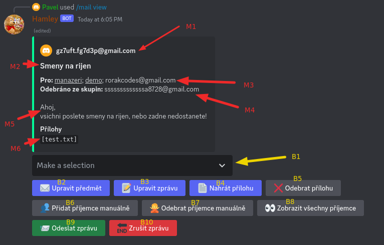
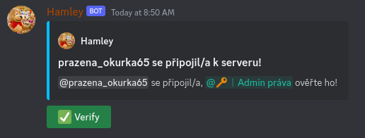

<h1>Hamleys discord guide</h1>

<!-- TOC -->
  * [Mailování](#mailování)
    * [Příkazy](#příkazy)
    * [Zpráva a tlačítka](#zpráva-a-tlačítka)
    * [Formátování zprávy](#formátování-zprávy)
  * [Ověření nového člena](#ověření-nového-člena)
    * [Jak člena ověřit a pustit na server](#jak-člena-ověřit-a-pustit-na-server)
    * [Přiřazení přezdívky pro nového člena](#přiřazení-přezdívky-pro-nového-člena)
    * [Přiřazení rolí pro člena](#přiřazení-rolí-pro-člena)
  * [Moderace](#moderace)
    * [Varování](#varování)
    * [Umlčení](#umlčení)
    * [Vyhození](#vyhození)
    * [Zákaz přístupu k serveru](#zákaz-přístupu-k-serveru)
  * [Ostatní důležité příkazy](#ostatní-důležité-příkazy)
<!-- TOC -->

## Mailování
+ Možné v jen kanálu [`#📧︱mail`](https://discord.com/channels/1101805661932752928/1131926379294904380)
+ K tomu také možné v **soukromých zprávách** přímo s botem
  + nevýhoda - některé zprávy se nemazají = **bordel**
### Příkazy
+ `/mail start` - Začne psát novou zprávu (jako tlačítko **+** v gmailu)
  + pouze jedna zpráva najednou!!
+ `/mail view` - Zobrazí tvojí aktuálně rozdělanou mailovou zprávu
    + a k tomu smaže starou zprávu, kde je tento mail vidět
+ `/mail stop` - Stejná funkce jako [tlačítko *Zrušit zprávu*](#zpráva-a-tlačítka)
+ `/mail send` - Stejná funkce jako [tlačítko *Odeslat zprávu*](#zpráva-a-tlačítka)
+ `/mail group add <group> <address>` - Přidá adresu (či více adres oddělených čárkou) *address* do skupiny *group*
+ `/mail group remove <group> <address>` - Odebere adresu *address* ze skupiny *group*
### Zpráva a tlačítka

> + **M1** - Tvůj email nebo tvé emailové jméno _(to co se zobrazuje jako jméno když email přijde)_
> + **M2** - Předmět zprávy
> + **M3** - Příjemci zprávy. <u>Podtržení</u> jsou skupiny příjemců, nepodtržení samostatní příjemci
> + **M4** - Emailové adresy, které jsou odebrané ze skupin. **Na tyto adresy se email nepošle**
> + **M5** - Text emailové zprávy (bez podpisu, s formátováním)
> + **M6** - Jména příloh ve zprávě
> ---
> + **B1** - Výběr skupin příjemců. Po vybrání bude skupina přidaná do příjemců, pokud už tam je, bude odebraná.
> + **B2** - Po kliknutí vyzve k napsání předmětu zprávy
> + **B3** - Po kliknutí vyzve k napsání textu zprávy (i s [formátováním](#formátování-zprávy))
> + **B4** - Po kliknutí vyzve k nahrání jedné či více příloh do zprávy
> + **B5** - Po kliknutí vyzve k napsání jmen příloh, které chceš odstranit. Zároveň dá na výběr všechny přílohy pro jednoduché zkopírování.
> + **B6** - Po kliknutí vyzve k přídání jednoho či více samostatných příjemců
> + **B7** - Po kliknutí vyzve k napsání emailových adres, které chceš odstranit z příjemců. Také dá na výběr všechny adresy. Lze odebírat i adresy ze skupin!!
> + **B8** - Po kliknutí zobrazí všechny jednotlivé příjemce
> + **B9** - Po kliknutí zobrazí potvrzovací dialog, a po něm email odešle
> + **B10** - Po kliknutí zobrazí potvrzovací dialog, a po něm email **navždy** smaže
### Formátování zprávy
* **text** - `**text**`
* <u>text</u> - `__text__`
* ~~text~~ - `~~text~~`
* *text* - `*text*` nebo `_text_`
* `text` - `` `text` ``
* # Text - `# Text`
* ## Text - `## Text`
* ### Text - `### Text`
* [Google odkaz](https://google.com/) - `[Google odkaz](https://google.com/)`

## Ověření nového člena
Po připojení nového člena se zobrazí takováto zpráva v kanálu [`#💻︱manager-konzole`](https://discord.com/channels/1101805661932752928/1101842402328719370):

### Jak člena ověřit a pustit na server
- Kliknutím na zelené tlačítko `Verify`
- Nebo použitím příkazu `/verify <user>`
- Nebo:
  - **Mobil:** Kliknout na ikonku uživatele vedle zprávy nebo v listu uživatelů, klinout na `Aplikace (cz) / Apps (en)` a pak `Verify`
  - **PC:** Kliknout pravým tlačítkem na ikonu uživatele vedle zprávy nebo v listu uživatelů, najet na `Aplikace (cz) / Apps (en)` a pak kliknout na `Verify`

### Přiřazení přezdívky pro nového člena
- **Mobil:** Kliknout na ikonu uživatele vedle zprávy nebo v listu uživatelů, sjet dolů, kliknout na `Spravovat (cz) / Manage (en)` a pak napsat novou přezdívku v jediném přítomném textovém poli.
- **PC:** Kliknout pravým tlačítkem na ikonu uživatele vedle zprávy nebo v listu uživatelů, vybrat `Změna přezdívky (cz) / Change nickname(en)` a pak napsat novou přezdívku.

### Přiřazení rolí pro člena
- **Mobil:** Kliknout na ikonu uživatele vedle zprávy nebo v listu uživatelů, sjet dolů, kliknout na `Spravovat (cz) / Manage (en)` a pak sjet dolů a kliknout na `Upravit role (cz) / Edit roles (en)`, vybrat role, které chceš a pak dát nahoře vpravo `Uložit (cz) / Save (en)`
- **PC**: Kliknout na ikonu uživatele vedle zprávy nebo v listu uživatelů, najet na `rolí (cz) / Roles (en)` a vybrat role, které chceš
- *Upozornění*: Poslední 3 bloky rolí (jazyky, pohlaví a DEMO produkty) si každý uživatel vybere sám, tak je nepřiřazuj

## Moderace
### Varování
+ `/warn <user> <reason>` - varuje uživatele
  + _user_ - uživatel, kterého chceš varovat
  + _reason_ - důvod, proč chceš tohoto uživatele varovat
+ pošle zprávu uživateli s varováním
+ hodí se použít když někdo jen trochu nedělá co má, nebo trochu dělá blbosti
### Umlčení
+ `/mute <user> [reason] [duration]` - umlčí uživatele (nemůže psát a mluvit)
  + _user_ - uživatel, kterého chceš umlčet
  + _reason_ - důvod, proč chceš daného uživatele umlčet - **nepovinné**
  + _duration_ - na jak dlouho chceš daného uživatele umlčet. Když neuvedeno - navždy - **nepovinné**
    + Formát např: `2d`, `3min`, `2 h`...
    + Pro zobrazení nápovědy formátu zadej místo doby nějakou blbost
+ `/unmute <user> [reason]` - odebere umlčení daného uživatele
  + _user_ - uživatel, kterému chceš odebrat umlčení (musí být umlčený)
  + _reason_ - důvod, proč mu chceš odebrat umlčení - **nepovinné**
+ zakáže uživateli psát do textových kanálu a mluvit v hlasových kanálech
+ napíše uživateli soukromou zprávu s důvodem a zmínkou toho, kdo ho umlčel
+ umlčení zůstane i když se uživatel odpojí a zase připojí k serveru
+ odebrat umlčení lze i kliknutím na tlačítko `Unmute` na informační zprávě o umlčení v kanálu [`#💻︱manager-konzole`](https://discord.com/channels/1101805661932752928/1101842402328719370)
### Vyhození
+ `/kick <user> [reason]` - vyhodní uživatele ze serveru (ale může se znovu připojit)
  + _user_ - uživatel, kterého chceš vyhodit
  + _reason_ - důvod, proč ho chceš vyhodit - **nepovinné**
+ hodí se když někdo opakovaně porušuje pravidla jako výstraha
+ danému uživateli pošle soukromou zprávu s důvodem, ale nepošle mu odkaz k připojení!!
### Zákaz přístupu k serveru
+ `/ban <user> [reason] [duration] [delete_messages]` - zakáže uživateli přístup k serveru
  + _user_ - uživatel, kterému chceš zakázat přístup k serveru
  + _reason_ - důvod, proč mu chceš zakázat přístup k serveru - **nepovinné**
  + _duration_ - na jak dlouho chceš danému uživateli přístup zakázat. Když neuvedeno - navždy - **nepovinné**
      + Formát např: `2d`, `3min`, `2 h`...
      + Pro zobrazení nápovědy formátu zadej místo doby nějakou blbost
  + *delete_messages* - jak staré zprávy od uživatele se mají mazat. Když neuvedeno - nemaže žádné - **nepovinné**
    + příklad: při hodnotě `2d`se smažou všechny zprávy staré dva dny a méně, které daný uživatel odeslal.
+ `/unban <username> [reason]` - odebere zákaz k serveru danému uživateli
  + _username_ - discord jméno daného uživatele, je tam nabídka všech zabanovaných hráčů!!
  + _reason_- důvod, proč uživateli odebrat zákaz přístupu - **nepovinné**
+ Daného uživatele vyhodí k serveru a už se nemůže znovu připojit.
+ Danému uživateli pošle zprávu s informacemi o jeho zákazu přístupu.
+ Při odebrání zákazu přístupu se to uživatel nedozví, musíte mu napsat sami.
+ Odebrat zákaz přístupu lze i kliknutím na tlačítko `Unban` na informační zprávě o umlčení v kanálu [`#💻︱manager-konzole`](https://discord.com/channels/1101805661932752928/1101842402328719370)

## Ostatní důležité příkazy
+ `/invite [onetime]` - Pošle ti pozvánku na tento server, kterou můžeš hned využít.
  + Pokud je _onetime_ nastaven na hodnotu `True`, tento invite je nově vytvořen a lze ho použít pouze jedinkrát
  + Pokud je _onetime_ nastaven na hodnotu `False`, nebo není vůbec uveden, tento invite je jeden klasický invite na server, který platí navždy
+ `/clear [count]` - Smaže zprávy v kanálu
  + Pokud je _count_ uveden, smaže daný počet zpráv
  + Pokud _count_ uveden není, smaže zprávy všechny